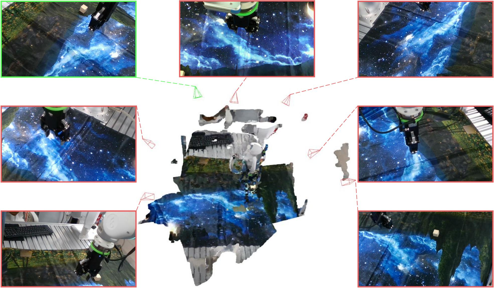

# X-NeRF: Explicit Neural Radiance Field for Multi-Scene 360° Insufficient RGB-D Views
Accepted by WACV 2023. Check out our [paper](https://arxiv.org/abs/2210.05135) on arXiv.
<div align="center">

</div>


## Requirements
* Python >= 3.8
* PyTorch == 1.9.1
* MinkowskiEngine == 0.5.4

## Installation
1. Install [PyTorch](https://pytorch.org/)

2. Install [PyTorch Scatter](https://github.com/rusty1s/pytorch_scatter)

3. Install [MinkowskiEngine](https://github.com/NVIDIA/MinkowskiEngine#anaconda)

4. Install `X-NeRF`
```bash
pip install -e .
```

## Quick Start
```bash
# training for single-scene
CUDA_VISIBLE_DEVICES=0 python scripts/train.py dataset=single_scene
# training for multi-scene
CUDA_VISIBLE_DEVICES=0 python scripts/train.py dataset=multi_scene
# eval
CUDA_VISIBLE_DEVICES=0 python scripts/eval.py dataset=multi_scene
```
Please refer to [./configs/](./configs/) for more details.

Note that training X-NeRF may consume much GPU memory. We use an NVIDIA A100 for training. You can reduce the batch size if you meet with OOM. And we have not supported multi-gpu training yet.

## Dataset
You can check our dataset in [./data/](./data/). The folder contains 10 scenes, each with 7 views. In our paper, we treat scene 1-6 as seen scenes and treat scene 7-10 as novel scenes to do zero-shot cross-scene evaluation. We use view 6 as novel view in all scenes. For more details about how to load and process the data, please refer to [XNeRF_SingleScene.py](./xnerf/datasets/XNeRF_SingleScene.py).

## Pre-trained Weights
You can download our pre-trained weight from [Google Drive](https://drive.google.com/file/d/1LZTQTIKmC36NufR9i0VR7uN1wdnPcNln/view?usp=sharing) or [Baidu Pan](https://pan.baidu.com/s/1wXAlqU6Su8GW4DZ0msn0sw?pwd=r8f4). To load the weight, you can set `ckpt_path={path/to/weight}` in the command.

## TO DOs
- [ ] Multi-gpu training
- [ ] Reduce the memory consumption when training
- [ ] More scenes
- [ ] More backbones

## Acknowledgement
The [CUDA extension](xnerf/utils/cuda/) for rendering is adapted from [DVGO](https://github.com/sunset1995/DirectVoxGO) and the [SH function](./xnerf/utils/render.py#L272) is adapted from [PlenOctrees](https://github.com/sxyu/plenoctree/blob/master/nerf_sh/nerf/sh.py).